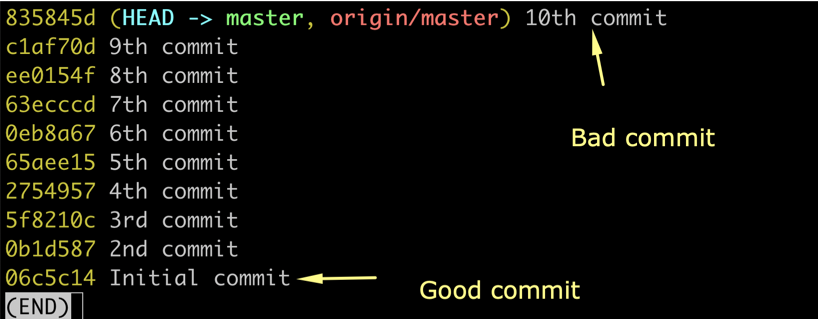
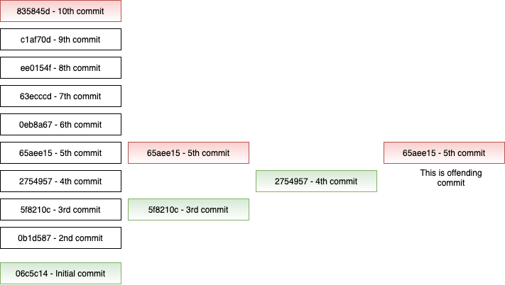

## What is git bisect?
`git-bisect - Use binary search to find the commit that introduced a bug`


## Why git bisect?
As an software engineers we work on complex systems on day to day basis, unintentionally we introduce bugs which will get noticed in later time. `git-bisect` will help you efficiently find that commit with bug introduction.

If you notice a bug in application with huge commit history which was introduced in past but the exact commit sha or time is not known, then git bisect is the tool can save your time.


## How to use bisect?
* Checkout master branch and pull latest code from upstream repo
* Find the commit history which had working and checkout it. `git checkout <<sha>>`
* Run your code and verify that bug doesn't exits
* Run `git bisect start` to initiate bisect
* Run `git bisect good` to mark this commit as good
* Run `git checkout master`
* Run `git bisect bad` to mark latest code as bad commit.
* It will automatically checkout commit sha which calculated with binary search(Usually this sha would be middle of master to working commit.)
* Run your code again if bug exists mark bisect as good or else mark as bad. `git bisect good` (if not bug) or `git bisect bad` (If bug exists)
* Continue this process till bisect tells your offending commit, and thats the place which introduced the bug.
* Once you found the place where bug was introduced, then you can conclude the bisect using `git bisect reset`

Example: 

Let say we have git repo which has 10 commits, we don't know what commit caused the bug but we know bug was not there in initial commit. So we will start bisect with latest commit and initial commit. 

Also lets assume that bug was introduced when export call return "Export commit 3"
```
➜ python index.py --export /test
Export commit 3
```

Clone test repo on your local
```
git clone https://github.com/ashokdudhade/git-bisect-demo.git
```

All commits:

```
git log --oneline
```




Checkout the branch where we know commit is good

```
git checkout 06c5c14
```

Start the bisect
```
git bisect start
```

Make sure the application is working state
```
➜  git-bisect-demo git:(06c5c14) python index.py -e l
Export initial
```

Mark the commit as good
```
git bisect good
```

Checkout master 
```git checkout master```

Mark the master as bad commit as we know it has bug
```git bisect bad```

It would output something like below and it will checkout next commit


Run the application to see if bug is there
```
➜  git-bisect-demo git:(65aee15) python index.py -e l
Export commit 4

```

Mark this as bad commit because "Export commit 4" displayed and we expect "Export commit 3"
```
git bisect bad
```


Run the application to see if bug is there
```
➜  git-bisect-demo git:(5f8210c) python index.py -e l
Export commit 3
```

This is the message we are expecting so we will mark it as good

```
git bisect good
```


Run the application to see if bug is there
```
➜  git-bisect-demo git:(2754957) python index.py -e l
Export commit 3

```
This is the message we are expecting so we will mark it as good

```
git bisect good
```

```
➜  git-bisect-demo git:(2754957) git bisect good
65aee158c45ac1d901293b413aa3efe89aea262e is the first bad commit
commit 65aee158c45ac1d901293b413aa3efe89aea262e
Author: 
Date:   Sat Jul 25 08:04:57 2020 -0500

    5th commit

:100644 100644 5a6e0ca2db884e650af657f600586661caa6d236 fa9cd39e2fe3d84dff6f0026cf6➜
```

This is the commit which introduced the bug, now we can go and fix it at proper location.

Conclude the bisect

```
git bisect reset
```

This will bring back to initial checkout, now you can checkout master and fix the issue.

This is how commits our picked for bisect




There are advanced ways to do similar activity, this article considers you are new to git bisect and provide beginners approach. This technique is pretty useful when large number of commits in your branch. 

Demo git repo is available here: https://github.com/ashokdudhade/git-bisect-demo